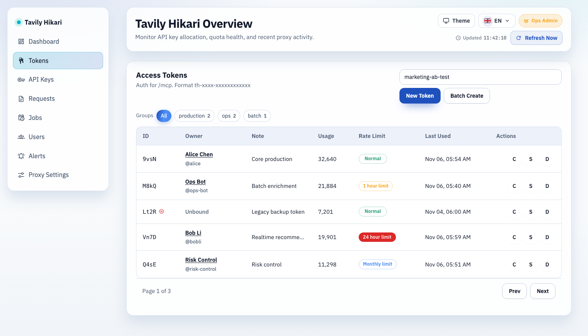
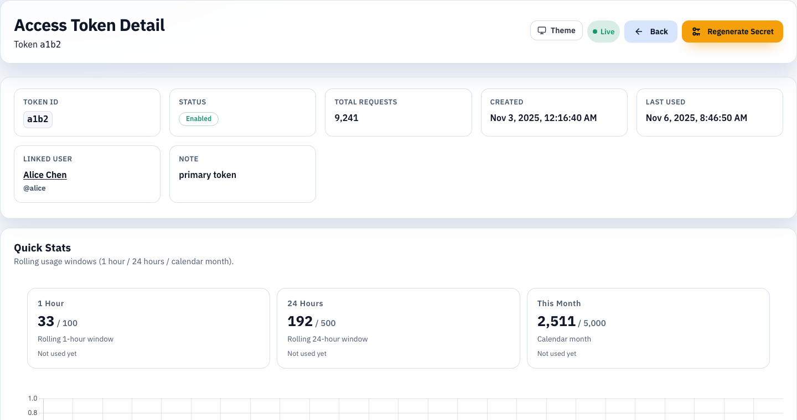

# Admin Tokens 关联用户补齐（#27ypg）

## 状态

- Status: 已完成
- Created: 2026-03-07
- Last: 2026-03-08

## 背景 / 问题陈述

- `/admin/tokens` 列表当前仅展示 token 自身字段，管理员无法直接识别该 token 关联的用户。
- `/admin/tokens/:id` 详情页同样缺少 owner 信息，排障时需要额外跳转到用户管理页或查数据库。
- 现有后端管理员 token DTO 未返回 owner 身份，前端无可用字段可渲染。

## 目标 / 非目标

### Goals

- 为管理员 token 列表接口与详情接口补齐统一的 `owner` 字段。
- 在列表页与详情页展示关联用户，显示规则固定为 `displayName || userId` 主行，`@username` 副行（存在时）。
- owner 可跳转至 `/admin/users/:id`，便于继续查看用户详情。
- 对未绑定 token 提供本地化占位文案，不显示空白。
- 补齐 Rust 测试与 Storybook mock，覆盖已绑定 / 未绑定两类场景。

### Non-goals

- 不修改用户控制台 `/api/user/tokens*` 协议。
- 不改变 token 绑定关系、配额计算、分页与筛选逻辑。
- 不新增用户搜索、批量跳转或额外 owner 编辑能力。

## 范围（Scope）

### In scope

- `src/lib.rs`
  - 新增 token -> user_id -> user identity 的批量查询能力，避免 token 列表走 N+1。
- `src/server/dto.rs` / `src/server/proxy.rs` / `src/server/handlers/admin_resources.rs`
  - 扩展管理员 token 视图，令 `GET /api/tokens` 与 `GET /api/tokens/:id` 返回一致的 `owner`。
- `src/server/tests.rs`
  - 覆盖管理员 token 列表/详情在 owner present / owner missing 下的响应。
- `web/src/api.ts`
  - 扩展 `AuthToken` 类型，补齐 owner 类型定义。
- `web/src/AdminDashboard.tsx`
  - 列表页桌面表格与移动卡片新增 owner 展示与跳转。
- `web/src/pages/TokenDetail.tsx`
  - metadata 区新增关联用户信息卡与跳转入口。
- `web/src/i18n.tsx`
  - 新增 owner 列标题、详情标签、未绑定占位中英文文案。
- `web/src/admin/AdminPages.stories.tsx` / `web/src/pages/TokenDetail.stories.tsx`
  - 新增 mock owner 数据与未绑定状态。

### Out of scope

- `/admin/users` 列表与用户详情布局本身不做结构调整。
- 公共首页、用户控制台、请求日志页无行为变化。

## 接口契约（Interfaces & Contracts）

### Public / external interfaces

- `GET /api/tokens`
- `GET /api/tokens/:id`

以上返回对象新增：

```json
{
  "owner": {
    "userId": "user_123",
    "displayName": "Ivan",
    "username": "ivanli"
  }
}
```

- 若 token 未绑定用户，则 `owner` 为 `null`。
- 其余字段与既有 token 契约保持不变。

### Internal interfaces

- 新增批量 user identity 查询路径，输入为去重后的 `user_id[]`，输出为 `user_id -> identity` map。
- owner 组装逻辑在列表接口与详情接口共用，避免字段漂移。

## 验收标准（Acceptance Criteria）

- Given 管理员访问 `/api/tokens`
  When token 已绑定用户
  Then 返回项包含 `owner.userId`、`owner.displayName`、`owner.username`（可为空）。
- Given 管理员访问 `/api/tokens/:id`
  When token 未绑定任何用户
  Then 返回项包含 `owner: null`。
- Given 管理员打开 `/admin/tokens`
  When token 已绑定用户
  Then 桌面表格与移动卡片都显示 owner 主行与副行，并可进入对应 `/admin/users/:id`。
- Given 管理员打开 `/admin/tokens/:id`
  When token 已绑定用户
  Then metadata 区出现“关联用户”信息卡，显示主行与副行并可跳转。
- Given token 未绑定用户
  When 页面渲染 owner 区域
  Then 显示本地化未绑定占位文案，而不是空白或 `—`。

## 非功能性验收 / 质量门槛（Quality Gates）

### Testing

- `cargo test`
- `cd web && bun run build`

### UI / Storybook

- Storybook token 列表页与 token 详情页均可看到 owner present / owner missing mock。
- 真实 admin 页面完成 owner 列表与详情验收；浏览器会话保留供复查。

## Visual Evidence (PR)

- source_type: storybook_canvas
  story_id_or_title: admin-pages--tokens
  state: default
  target_program: mock-only
  capture_scope: browser-viewport
  sensitive_exclusion: N/A
  submission_gate: approved
  evidence_note: verifies the admin token list shows bound and unbound owner states, and owner names are rendered as clickable review targets.
  image:
  

- source_type: storybook_canvas
  story_id_or_title: admin-pages-tokendetail--default
  state: default
  target_program: mock-only
  capture_scope: browser-viewport
  sensitive_exclusion: N/A
  submission_gate: approved
  evidence_note: verifies the token detail metadata card exposes the linked user block with clickable owner text.
  image:
  

## 实现里程碑（Milestones / Delivery checklist）

- [x] M1: 后端 owner DTO 与批量查询路径落地
- [x] M2: 管理员 token 列表页新增 owner 展示（桌面 + 移动）
- [x] M3: token 详情页新增 owner 信息卡与跳转
- [x] M4: Rust 测试、i18n、Storybook mock 完成
- [x] M5: build + 浏览器验收 + 快车道交付完成

## 风险 / 开放问题 / 假设

- 风险：token 列表分页接口若逐条查 owner 会导致明显的 N+1，需要在后端一次性批量取回。
- 假设：同一 token 最多关联一个 `user_id`，当前 `user_token_bindings` 语义不变。
- 假设：owner 展示优先级固定为 `displayName || userId`，`@username` 仅在存在时显示。

## 变更记录（Change log）

- 2026-03-07: 创建快车道 spec，约束 owner DTO、列表/详情展示规则与验收口径。

- 2026-03-07: 已完成 owner DTO、管理员 token 列表/详情展示、Rust 测试与 Storybook mock；通过 `cargo test`、`cd web && bun run build`，并在 `http://127.0.0.1:58097/admin/tokens` 与 `http://127.0.0.1:58097/admin/tokens/:id` 完成 dev-open-admin 验收。
